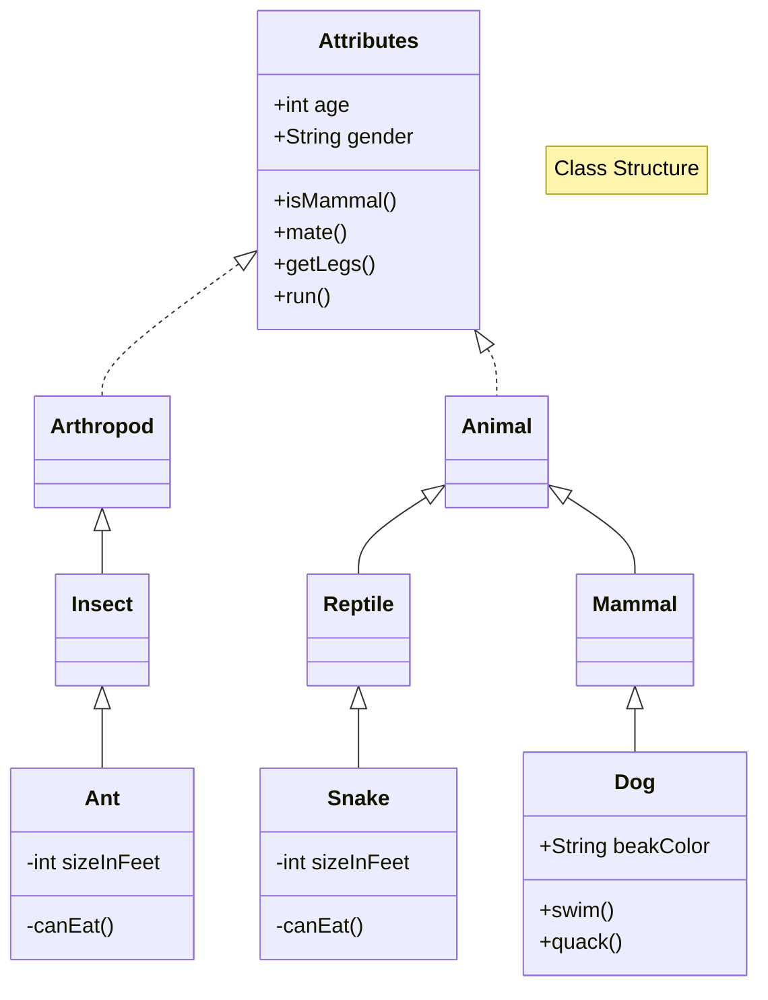

# JavaOOP
Project displaying OOP concepts

```mermaid
classDiagram
    note "Class Structure"
  
    Attributes <|.. Arthropod
    Attributes <|.. Animal
    Animal <|-- Reptile
    Animal <|-- Mammal
    Arthropod <|-- Insect
    Reptile <|-- Snake
    Mammal <|-- Dog
    Insect <|-- Ant
    Attributes : +int age
    Attributes : +String gender
    Attributes: +isMammal()
    Attributes: +mate()
    class Dog{
        +String beakColor
        +swim()
        +quack()
    }
    class Ant{
        -int sizeInFeet
        -canEat()
    }

    class Snake{
        -int sizeInFeet
        -canEat()
    }
    class Attributes{
        +getLegs()
        +run()
    }
```